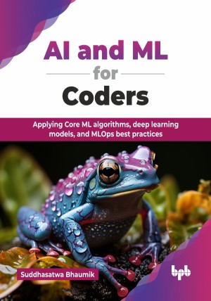

# AI and ML for Coders

Applying Core ML algorithms, deep learning models, and MLOps best practices.

This is the repository for [AI and ML for Coders
](https://bpbonline.com/products/ai-and-ml-for-coders?variant=44651152244936),published by BPB Publications.

## About the Book
AI and ML are reshaping industries and creating unprecedented opportunities for innovation. They play a crucial role in helping businesses grow in a multitude of use cases and create applications, used by millions worldwide. Designed for coders of all levels, this book bridges the gap between theoretical concepts and real-world applications, empowering you to build intelligent systems.

In this book, the readers will work with code, tackling fundamental topics like ML, by grasping core principles through practical coding exercises,  followed by computer vision, where the code is trained to see the world and learn image processing techniques like feature detection, empowering applications to analyze and interpret visual data. This is followed by natural language processing (NLP), which enables the software to understand and manipulate language by utilizing techniques like tokenization, sentence sequencing, and more. Additionally, this book also talks about sequence modeling, whereby readers master techniques like recurrent neural networks (RNNs) and Long Short-Term Memory (LSTM) networks, as well as MLOps for deploying and scaling your AI/ML solutions on-premise and in the cloud, with tools like TensorFlow Extended (TFX) and Kubeflow.

By the end of the book, readers will learn to build ML models, deploy AI on diverse platforms, and serve models online and in the cloud, ensuring smooth and scalable AI solutions. They will be equipped with the knowledge of industry-standard tools and best practices.

## What You Will Learn
• Implement ML models with Scikit-learn and TensorFlow across various tasks.

• Build NLP applications with text processing, embeddings, and sequence models.

• Deploy and scale ML models using MLOps, TensorFlow Serving, and mobile tools.

• Learn to bring innovative changes and solutions to use cases across industries.

• Develop scalable solutions using CNNs, object detection, and segmentation.
